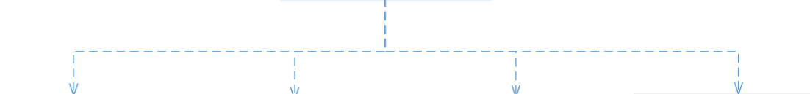
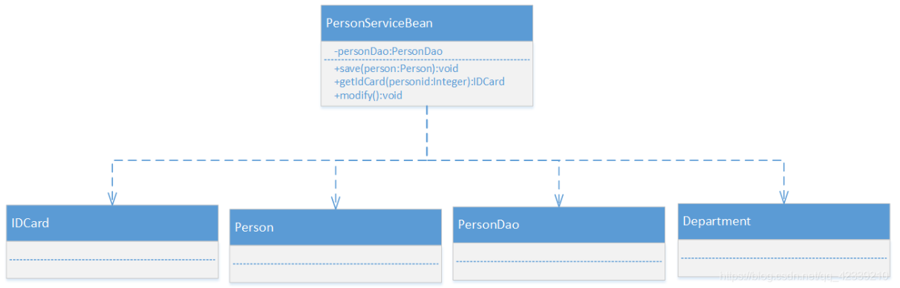
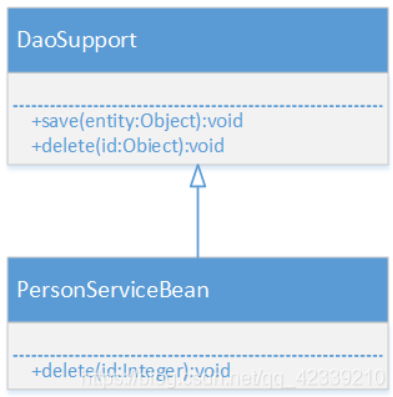
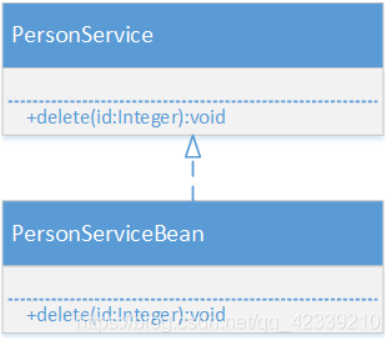
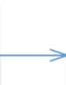
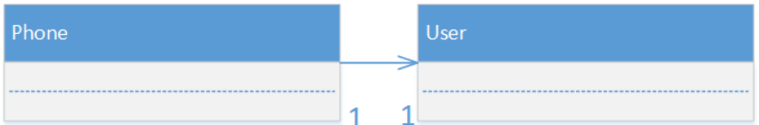
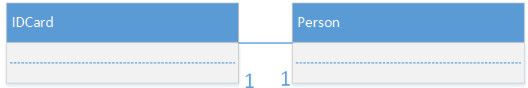
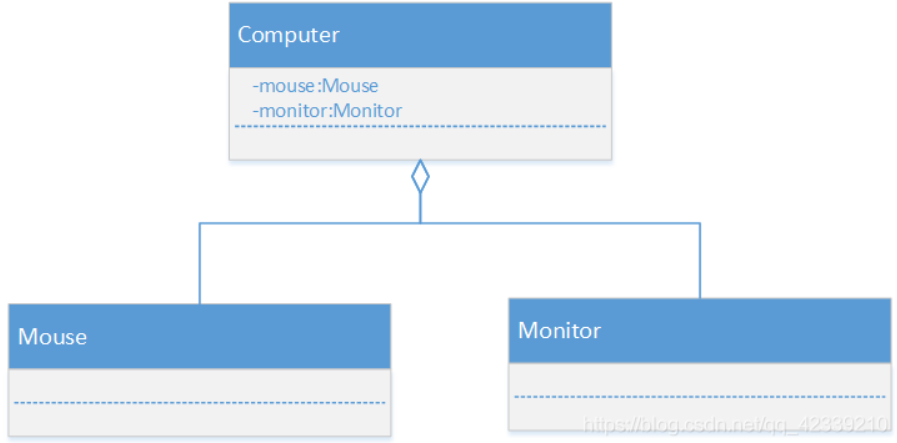

# UML关系分析及总结

## 1、依赖关系

定义：只要在类中用到了对方，那么它们之间就存在依赖关系。

连接图示：

示例类图：

## 2、泛化关系

定义：泛化关系其实就是继承关系，它是依赖关系的特例。

连接图示：

示例类图：

## 3、实现关系

定义：A类实现B接口，它是依赖关系的特例。

连接图示：虚线空三角

示例类图：

## 4、关联关系

定义：实际上就是类与类之间的联系，他是依赖关系的特例。

- 单向一对一

连接图示：单向实线

示例类图：

- 双向一对一

连接图示：无向实线

示例类图：

## 5、聚合关系

定义：表示的是整体与部分之间的关系，**整体与部分可以分开**。聚合关系是关联关系的特例。

连接图示：实线空心菱形

示例类图：

## 6、组合关系

定义：整体与部分的关系，但是**整体与部分不可以分开**。**即：整体与部分是同生共死的关系。**

连接图示：实线实心菱形

## 7、参考

https://blog.csdn.net/qq_42339210/article/details/106714076