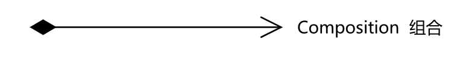

# UML类图关系分析及总结

[TOC]

## 1、类图关系概述

关系图示概要图：

六种关系中，**组合、聚合、关联的代码结构是相同的**，可以从关系的强弱来理解。从强到弱的顺序是：**继承→实现→组合→聚合→关联→依赖**。

## 2、六种类图关系

### 2.1、关联关系

**定义：**表示一个类的属性持有对另一个类的一个（或多个）实例的引用。实际上就是类与类之间的联系，它是依赖关系的特例。

>  关联关系**存在四种**：双向关联、单项关联、自关联、多号关联

**图示：**实线箭头

**示例类图：**

> 驾驶员Driver和车Car
>
> 

### 2.2、继承（泛化）关系

**定义：**用于描述**父类和子类**之间的关系，父类也称为**基类**，子类也成为**派生类**。

**图示：**实线空三角

**示例类图：**

### 2.3、实现关系

**定义：**指定**接口**与**实现类**之间的关系，由类指向接口。

**图示：**

**示例类图：**

> 车Car类和商店Ship实现车辆Vehicle接口

### 2.4、依赖关系

**定义：**假设A类的变化导致了B类出现了变化，则B类依赖于A类。

**图示：**虚线箭头，或**虚线实心三角**

**示例类图：**

>  **车Car**和**油Oil**的关系

### 2.5、聚合关系

**定义：**整体与部分的关系，**整体与部分可以分离。**聚合关系是关联关系的特例。

**图示：**实线空心菱形

**示例类图：**

### 2.6、组合关系

**定义：**整体与局部的关系，**但整体与局部不可分割**。

**图示：**实线实心菱形

**示例类图：**

