# 一、各类设计模式及模式结构图

## 1、设计模式六大原则（SOLID）

**总原则——开闭原则（Open Closed Principle）**

> 一个软件实体，如类、模块和函数应该**对扩展开放，对修改关闭**。
>
> ​	——在程序需要进行拓展的时候，不能去修改原有的代码，而是要扩展原有代码。以保证程序的扩展性好，易于维护和升级。

**单一职责原则（Single Responsibility Principle）**

> 一个类应该只有**一个**发生变化的原因。
>
> ​	——每个类应该实现单一的职责，不能存在多于一个导致类变更的原因。

**里氏替换原则（Liskov Substitution Principle）**

> 所有引用基类的地方必须能透明地使用其子类的对象，**子类对父类的方法尽量不要重写和重载**。
>
> ​	——任何基类可以出现的地方，子类一定可以出现，确保可以继承复用。

**依赖倒置原则（Dependence Inversion Principle）**

> 1、上层模块不应该依赖底层模块，它们都应该依赖于抽象。
> 2、抽象不应该依赖于细节，细节应该依赖于抽象。
>
> ​	——面向接口编程，依赖于抽象而不依赖于具体。写代码时用到具体类时，不与具体类交互，而与具体类的上层接口交互。

**接口隔离原则（Interface Segregation Principle）**

> 1、客户端不应该依赖它不需要的接口。
> 2、类间的依赖关系应该建立在最小的接口上。
>
> ​	——接口中不应存在子类用不到却必须实现的方法，如果有则必须将接口拆分；使用多个隔离的接口，比使用单个接口（多个接口方法集合到一个的接口）要好。

**迪米特法则（最少知道原则）(Law of Demeter)**

> 只与你的直接朋友交谈，不跟“陌生人”说话。
>
> ​	——一个类对自己依赖的类知道的越少越好。无论被依赖的类多么复杂，都应该将逻辑封装在方法的内部，通过public方法提供给外部。这样当被依赖的类变化时，才能最小的影响该类。
>
> ​	——最少知道原则的另一个表达方式是：只与直接的朋友通信。类之间只要有耦合关系，就叫朋友关系。耦合分为依赖、关联、聚合、组合等。我们称出现为成员变量、方法参数、方法返回值中的类为直接朋友。局部变量、临时变量则不是直接的朋友。我们要求陌生的类不要作为局部变量出现在类中。

**合成复用原则（Composite Reuse Principle）**

> 尽量使用对象组合/聚合，而不是继承关系达到软件复用的目的。
>
> ​	——合成或聚合可以将已有对象纳入到新对象中，使之成为新对象的一部分，因此新对象可以调用已有对象的功能。

**记忆口诀：**SOLID CD

## 2、设计模式分类及适用场景

分为**创建型设计模式**、**结构性设计模式**、**行为型设计模式**三种，都有着各自的适用场景。

**创建型设计模式（Creational Pattern）：**

> 对类的实例化过程进行了抽象，能够将软件模块中**对象的创建**和**对象的使用**进行分离。

**结构性设计模式（Structual Pattern）：**

> 关注对象的组成以及对象之间的依赖关系，描述如何将**类或者对象结合**在一起**形成更大**的结构，类似于搭积木。

**行为型设计模式（Behavioral Pattern）：**

> 关注对象的行为问题，在不同的对象之间划分责任和算法的抽象化；关注**类和对象的结构**，而且关注对象之间的**相互作用**。

## 3、GOF经典设计模式及其结构图

### 3-1、创建型

一共有五种典型的设计模式，如下：

> 记忆口诀：创工原 单建抽（创公园 但见愁）

#### 1）工厂模式-Factory Pattern

Java中常用的设计模式之一，工厂模式在创建对象的过程中不会对客户端暴露创建逻辑，并且通过使用一个共同的接口来指向新创建的对象。

> 定义一个创建对象的接口，让其子类决定实例化哪一个类，该模式使得一个类实例化（创建过程）延迟到其子类中进行

**[实例]：**

> 一个咖啡店点餐系统：设计一个咖啡类（Coffee），定义其中的两个子类（美事咖啡【AmericanCoffee】和拿铁咖啡【LatteCoffee】）；再设计一个咖啡店类（CoffeeStore），咖啡店具有点咖啡的功能。

**[实例类图]：**

右侧Coffe为工厂类，左侧CoffeStore为实例

参考：https://blog.csdn.net/shaAmerica/article/details/125289598

#### 2）抽象工厂模式-Abstract Factory Pattern

**抽象工厂模式**是一个比较复杂的创建型模式，不同于工厂模式，在工厂模式中的工厂和产品是具体的，抽象工厂模式解决的为复杂的问题，其中工厂和产品均为抽象的，而且有多个产品需要创建。因而抽象工厂会对应到多个实际工厂，每个实际工厂负责创建多个实际产品。

> 提供一个创建一系列相关或相互依赖对象的接口，而无需指定他们具体的类

类似于多个供应商负责一些列类型的产品。

**[实例]：**

> 创建 *Shape* 和 *Color* 接口和实现这些接口的实体类。先创建抽象工厂类 *AbstractFactory*。接着定义工厂类 *ShapeFactory* 和 *ColorFactory*，这两个工厂类都是扩展了 *AbstractFactory*。然后创建一个工厂创造器/生成器类 *FactoryProducer*。

**[实例类图]：**

![抽象工厂模式-结构图解-[菜鸟]](D:\个人文档\学习笔记\Markdown文档-Study\一、各类设计模式及模式图.assets\抽象工厂模式-结构图解-[菜鸟].jpg)

参考：

https://www.runoob.com/design-pattern/abstract-factory-pattern.html

https://www.cnblogs.com/blknemo/p/13257214.html

#### 3）单例模式-Singleton Pattern

> 保证一个类仅有一个实例，并提供一个访问它的全局访问点。

单例模式相对简单，涉及到一个单一的类，该类负责创建自己的对象，同时确保只有**单个对象（实例）**被创建。这个类提供了一种访问其唯一的对象的方式，可以直接访问，不需要实例化该类的对象。

**[结构图]：**

**[实例]：**

> 一个人同时只能拥有一个婚姻，如果在民政局已经登记过婚姻，再次登记婚姻就会抛出已经结婚的异常。

**[实例类图]：**

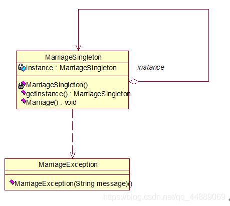

参考：https://blog.csdn.net/qq_44889069/article/details/106175196

#### 4）建造者模式-Builder Pattern

**建造者模式**（Builder Pattern），也称为生成器模式。

> 使用多个简单的对象一步步的构建成一个复杂的对象。——其将一个复杂的构建与其表示相分离，使得同样的构建过程可以创建不同的表示。提供了一种创建对象的最佳方式。

**[实例]：**

> 如：
>
> ​	1、去肯德基，汉堡、可乐、薯条、炸鸡翅等是不变的，而其组合是经常变化的，生成出所谓的"套餐"。
>
> ​	2、Java 中的 StringBuilder。
>
> **实例构建细节：**
>
> 1、假设一个快餐店的商业案例，其中，一个典型的套餐可以是一个汉堡（Burger）和一杯冷饮（Cold drink）。汉堡（Burger）可以是素食汉堡（Veg Burger）或鸡肉汉堡（Chicken Burger），它们是包在纸盒中。冷饮（Cold drink）可以是可口可乐（coke）或百事可乐（pepsi），它们是装在瓶子中。
>
> 2、创建一个表示食物条目（比如汉堡和冷饮）的 *Item* 接口和实现 *Item* 接口的实体类，以及一个表示食物包装的 *Packing* 接口和实现 *Packing* 接口的实体类，汉堡是包在纸盒中，冷饮是装在瓶子中。
>
> 3、然后我们创建一个 *Meal* 类，带有 *Item* 的 *ArrayList* 和一个通过结合 *Item* 来创建不同类型的 *Meal* 对象的 *MealBuilder*。*BuilderPatternDemo* 类使用 *MealBuilder* 来创建一个 *Meal*。

**[实例类图]：**

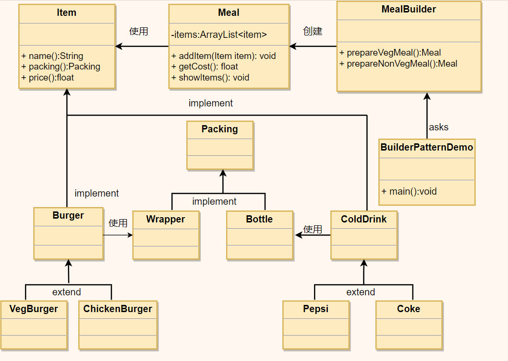

#### 5）原型模式-Prototype Pattern

**原型模式（Prototype Pattern）**，这种模式是实现了一个原型接口，该接口用于创建当前对象的克隆。当直接创建对象的代价比较大时，则采用这种模式

> 用原型实例指定创建对象的种类，并且通过拷贝这些原型创建新的对象。——用于创建重复的对象，同时保证性能。

例如：一个对象需要在一个高代价的数据库操作之后被创建。我们可以缓存该对象，在下一个请求时返回它的克隆，在需要的时候更新数据库，以此来减少数据库调用。

**[实例]：**

> 1、细胞分裂；
>
> 2、Java中的 Object clone() 方法。

**[实例类图]：**

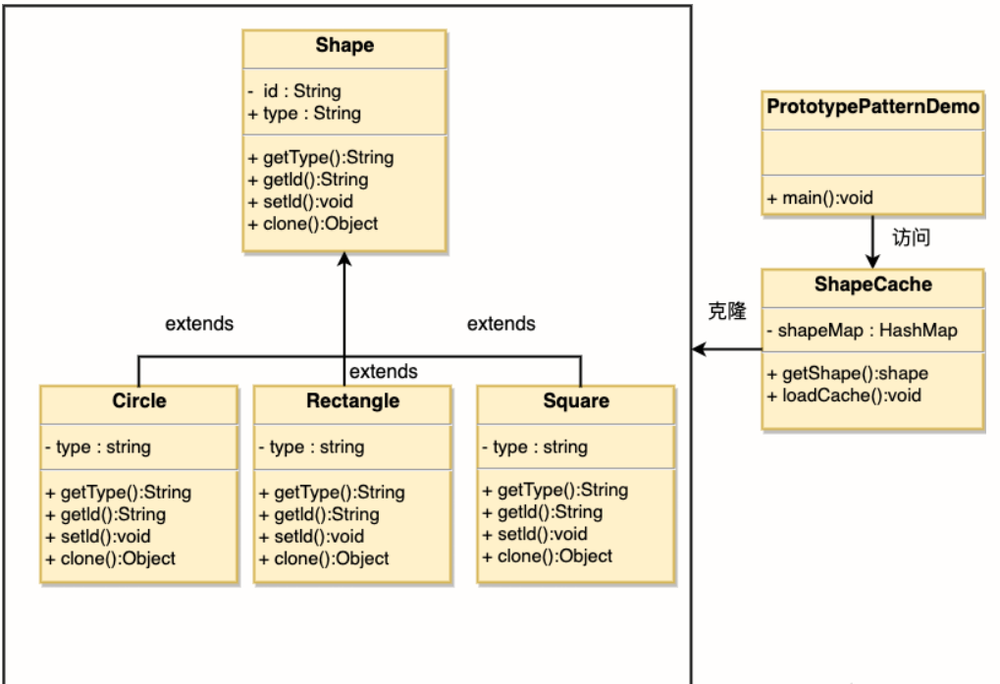

### 3-2、结构型

一共七种典型设计模式，记忆口诀：

> 结享外组适代装桥（姐想外租，世代装桥）

#### 1）适配器模式-Adapter Pattern

**适配器模式（Adapter Pattern）**，作为两个不兼容的接口之间的桥梁。

> 将一个类的接口转换成客户希望的另外一个接口，使得原本由于接口不兼容而不能一起工作的那些类可以一起工作

**[应用实例]：**

> 1、如读卡器，在电脑和存储卡之间作为连接适配器，电脑通过读卡器来读取存储卡中的内容。
>
> 2、在美国和中国的电器标准下，去美国旅游需要一个变压器来作为适配器连接电器以正常使用。
>
> 3、Java中的JDBC，通过JDBC驱动来连接数据库。

**[实现实例]：**

> 我们有一个 *MediaPlayer* 接口和一个实现了 *MediaPlayer* 接口的实体类 *AudioPlayer*。默认情况下，*AudioPlayer* 可以播放 mp3 格式的音频文件。
>
> 我们还有另一个接口 *AdvancedMediaPlayer* 和实现了 *AdvancedMediaPlayer* 接口的实体类。该类可以播放 vlc 和 mp4 格式的文件。
>
> 我们想要让 *AudioPlayer* 播放其他格式的音频文件。为了实现这个功能，我们需要创建一个实现了 *MediaPlayer* 接口的适配器类 *MediaAdapter*，并使用 *AdvancedMediaPlayer* 对象来播放所需的格式。
>
> *AudioPlayer* 使用适配器类 *MediaAdapter* 传递所需的音频类型，不需要知道能播放所需格式音频的实际类。*AdapterPatternDemo* 类使用 *AudioPlayer* 类来播放各种格式。

**[实例类图]：**

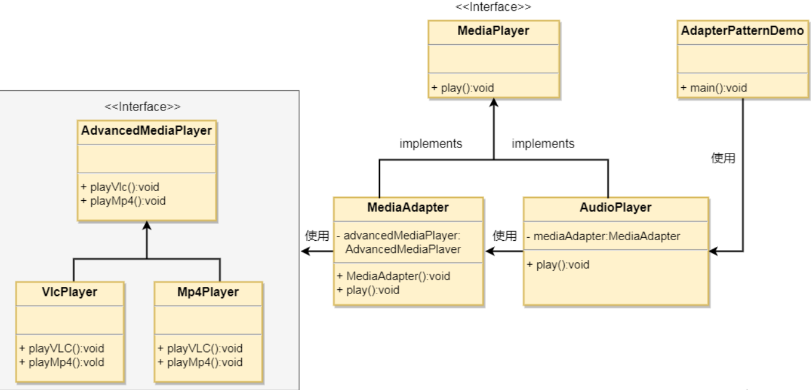

#### 2）装饰者模式-Decorator Pattern

**装饰器模式（Decorator Pattern）**，是一种在运行期间动态给某个对象的实例增加功能的方法。（与原始类相互独立，互补影响）

> 动态地给一个对象添加额外的职责。就增加功能来说，比生成子类更为的灵活。

这种模式创建了一个装饰类，用来包装原有的类，并在保持类方法签名完整性的前提下，提供了额外的功能。

**[应用实例]：**

> 1、将一个形状装饰上不同的颜色，同时对形状不改变
>
> 2、孙悟空七十二变，变为其他形态后，本质上还是猴子

**[实现实例]：**

> 我们将创建一个 *Shape* 接口和实现了 *Shape* 接口的实体类。然后我们创建一个实现了 *Shape* 接口的抽象装饰类 *ShapeDecorator*，并把 *Shape* 对象作为它的实例变量。
>
> *RedShapeDecorator* 是实现了 *ShapeDecorator* 的实体类。
>
> *DecoratorPatternDemo* 类使用 *RedShapeDecorator* 来装饰 *Shape* 对象。

**[实例类图]：**

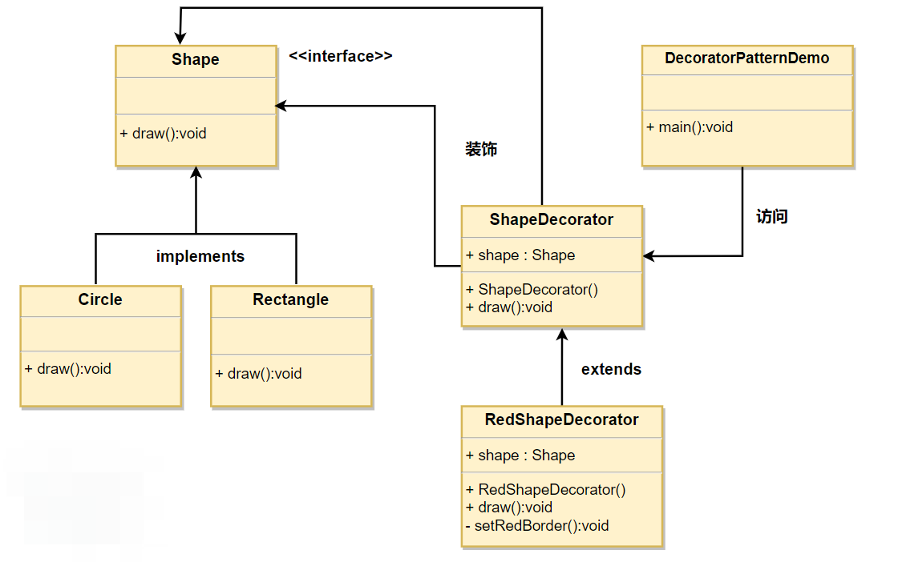

#### 3）代理模式-Proxy Pattern

**代理模式（Proxy Pattern）**，一个类可以代表另一个类的功能。在代理模式中，可创建具有现有对象的对象，以便向外界提供功能接口。

> 为其他对象提供一种代理以控制这个对象的访问

**注：**

- 和适配器的区别：适配器模式主要改变所考虑对象的接口，而代理模式不改变所代理类的接口
- 和装饰器模式的区别：装饰器模式为了增强功能，而代理模式是为了加以控制

**[应用实例]：**

> 1、Windows里面的快捷方式(程序访问路径映射)；
>
> 2、买火车票不一定在火车站买，也可以去代售点；
>
> 3、一张支票或银行存单是账户中资金的代理。支票在市场交易中用来代替现金，并提供对签发人账号上资金的控制；
>
> 4、Spring AOP。

**[实现实例]：**

> 我们将创建一个 *Image* 接口和实现了 *Image* 接口的实体类。*ProxyImage* 是一个代理类，减少 *RealImage* 对象加载的内存占用。
>
> *ProxyPatternDemo* 类使用 *ProxyImage* 来获取要加载的 *Image* 对象，并按照需求进行显示。

**[实例类图]：**

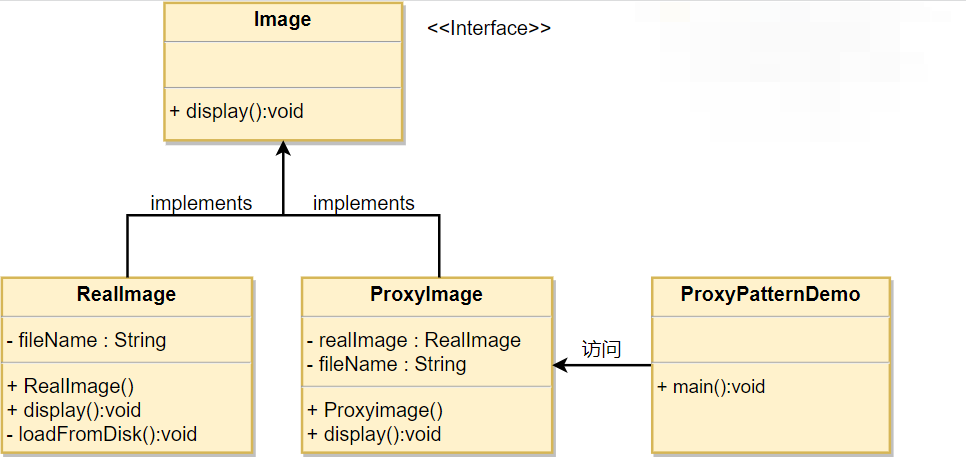

#### 4）外观模式-Facade Pattern

**外观模式（Facade Pattern）**，是一个相对简单的模式，它隐藏系统的复杂性，并向客户端提供一个客户端可以访问系统的接口。

> 为子系统中的一组接口提供一个一致的界面。Facade模式定义了一个高层接口，这个接口使得这一子系统更加容易使用。

这种模式涉及到一个单一的类，该类提供了客户端请求的简化方法和对现有系统类方法的委托调用。

基本思想：如果客户端要跟许多子系统打交道，那么客户端需要了解各个子系统的接口，比较麻烦。如果有一个统一的“中介”，让客户端只跟中介打交道，中介再去跟各个子系统打交道，对客户端来说就比较简单。其中Facade相当于中介。

**[应用实例]：**

> 去医院看病，可能要去挂号、门诊、划价、取药，让患者或患者家属觉得很复杂，如果有提供接待人员，只让接待人员来处理，就很方便。

**[实现实例]：**

> 我们将创建一个 *Shape* 接口和实现了 *Shape* 接口的实体类。下一步是定义一个外观类 *ShapeMaker*。*ShapeMaker* 类使用实体类来代表用户对这些类的调用。*FacadePatternDemo* 类使用 *ShapeMaker* 类来显示结果。

**[实例类图]：**

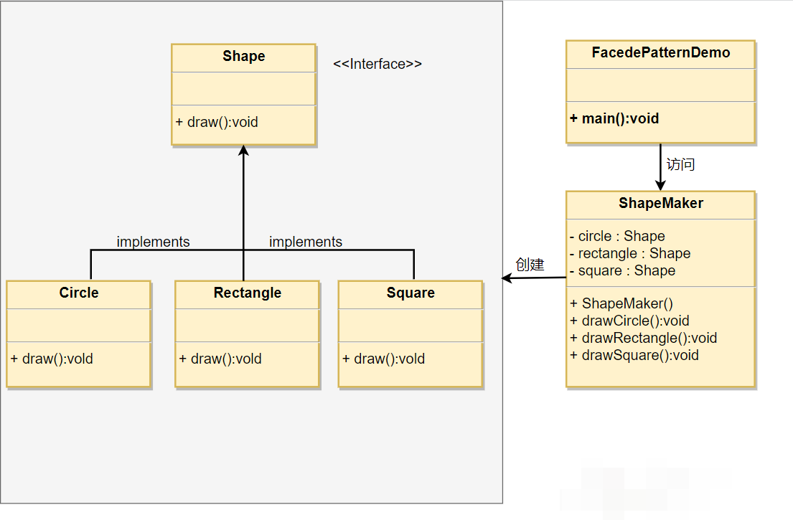

#### 5）桥接模式-Bridge Pattern

**桥接模式（Bridge Pattern）**，又称为柄体（Handle and Body）模式或接口模式，是用于把抽象化与实现化解耦，使得二者可以独立变化。它通过提供抽象化和实现化之间的桥接结构，来实现二者的解耦。

> 将抽象部分与它的实现部分分离，使它们都可以独立地变化。

这种模式涉及到一个作为桥接的接口，使得实体类的功能独立于接口实现类，这两种类型的类可悲结构化改变而互不影响。

**注：**对于两个独立变化的维度，适合使用桥接模式。

**[应用实例]：**

> 1、猪八戒从天蓬元帅转世投胎到猪，转世投胎的机制将尘世划分为两个等级，即：灵魂和肉体，前者相当于抽象化，后者相当于实现化。生灵通过功能的委派，调用肉体对象的功能，使得生灵可以动态地选择；
>
> 2、墙上的开关，可以看到的开关是抽象的，不用管里面具体怎么实现的；
>
> 3、如果要绘制不同的颜色，如红色、绿色、蓝色的矩形、圆形、椭圆、正方形，我们需要根据实际需要对形状和颜色进行组合，那么颜色、形状就是抽象部分，组合后的就是实现部分。

**[实现实例]：**

> 我们有一个作为桥接实现的 *DrawAPI* 接口和实现了 *DrawAPI* 接口的实体类 *RedCircle*、*GreenCircle*。*Shape* 是一个抽象类，将使用 *DrawAPI* 的对象。*BridgePatternDemo* 类使用 *Shape* 类来画出不同颜色的圆。

**[实例类图]：**

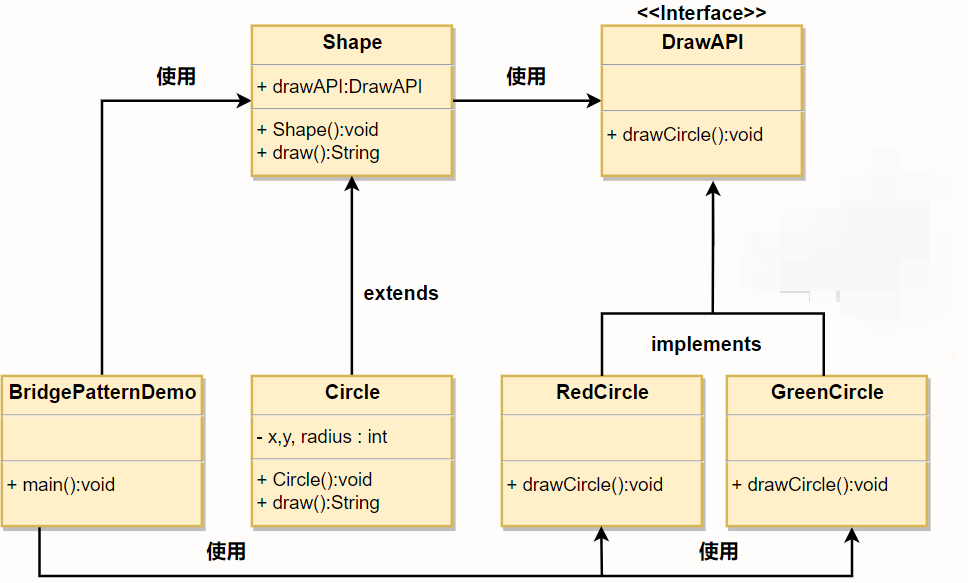

#### 6）组合模式-Composite Pattern

**组合模式（Composite Pattern）**，又叫做部分整体模式，用于把一组相似的对象当做一个单一的对象。组合模式依据属性结构来组合对象，用来表示部分以及整体层次。

> 将对象组合成树形结构以表示“部分-整体”的层次结构，使得用户对单个对象和组合对象的使用具有一致性。

组合模式经常用于树形结构，为了简化代码，使用Composite可以把一个叶子结点与一个父节点统一起来处理。

**[应用实例]：**

> 1、算术表达式包括操作数、操作符和另一个操作数，其中，另一个操作数也可以是操作数、操作符和另一个操作数。
>
> 2、在JAVA AWT和SWING中，对于Button和Checkbox是树叶，Container是树枝。

**[实现实例]：**

> 我们有一个类 *Employee*，该类被当作组合模型类。*CompositePatternDemo* 类使用 *Employee* 类来添加部门层次结构，并打印所有员工。

**[实例类图]：**

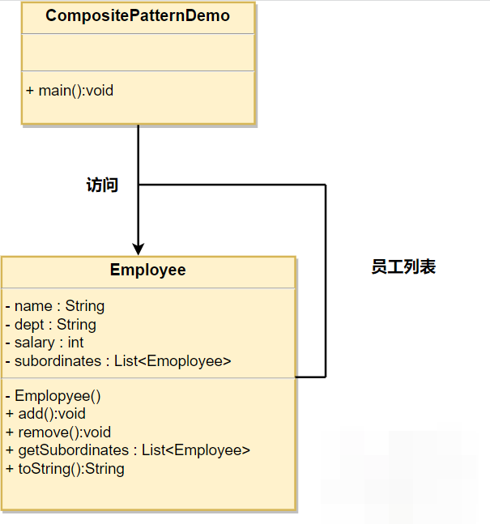

#### 7）享元模式-Flyweight Pattern

**享元模式（Flyweight Pattern）**，主要用于减少创建对象的数量，以减少内存占用和提高性能。它提供了减少对象数量从而改善应用所需的对象结构的方式。

> 运用共享技术有效地支持大量细粒度的对象

核心思想：如果一个对象实例一经创建就不可变，那么反复创建相同的实例就没有必要，直接向调用方向返回一个共享的实例就行，这样既节省内存，又可以减少创建对象的过程，提高运行速度。

**[应用实例]：**

> 1、Java中的String，如果有则返回，如果没有则创建一个字符串保存在字符串缓存池里面；
>
> 2、数据库的数据池。

**[实现实例]：**

> 我们将创建一个 *Shape* 接口和实现了 *Shape* 接口的实体类 *Circle*。下一步是定义工厂类 *ShapeFactory*。
>
> *ShapeFactory* 有一个 *Circle* 的 *HashMap*，其中键名为 *Circle* 对象的颜色。无论何时接收到请求，都会创建一个特定颜色的圆。*ShapeFactory* 检查它的 *HashMap* 中的 circle 对象，如果找到 *Circle* 对象，则返回该对象，否则将创建一个存储在 hashmap 中以备后续使用的新对象，并把该对象返回到客户端。
>
> *FlyWeightPatternDemo* 类使用 *ShapeFactory* 来获取 *Shape* 对象。它将向 *ShapeFactory* 传递信息（*red / green / blue/ black / white*），以便获取它所需对象的颜色。

**[实例类图]：**

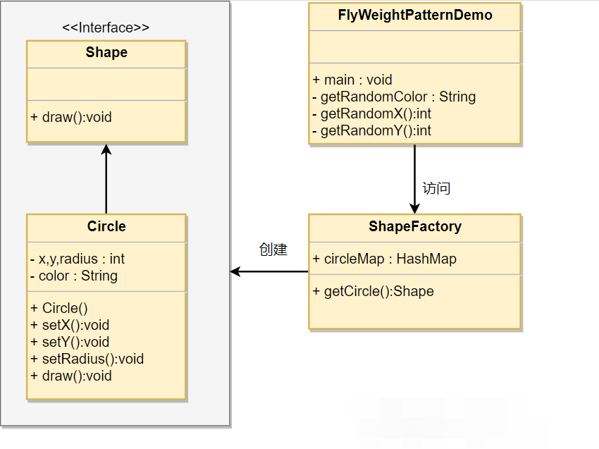

### 3-3、行为型

一共包含11中设计模式，如下：

> 记忆口诀：行状责中模访解备观策命迭（形状折中模仿，戒备观测鸣笛）

#### 1）策略模式-Strategy Pattern

**策略模式（Strategy Pattern）**，策略是指定义一组算法，并将其封装到一个对象中。然后再运行时，可以灵活地使用其中的一个算法。

> 定义一些列的算法，把他们一个个封装起来，并且使他们可相互替换。

在策略模式中，我们创建表示各种策略的对象和一个行为随着策略对象改变而改变的context对象，策略对象改变context对象的执行算法。

**[应用实例]：**

> 1、诸葛亮的锦囊妙计，每一个锦囊就是一个策略；
>
> 2、旅行的出游方式，选择骑自行车、坐汽车，每一种旅行方式都是一个策略。

**[实例实现]：**

> 我们将创建一个定义活动的 *Strategy* 接口和实现了 *Strategy* 接口的实体策略类。*Context* 是一个使用了某种策略的类。
>
> *StrategyPatternDemo*，我们的演示类使用 *Context* 和策略对象来演示 Context 在它所配置或使用的策略改变时的行为变化。

**[实例类图]：**

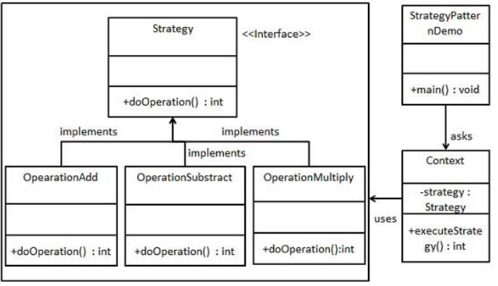

#### 2）模板方法模式-Template Pattern

**模板方法（Template Pattern）**，一个抽象类公开定义了执行它的方法的方式/模板。它的子类可以按需重写方法实现，但调用将以抽象类中定义的方式进行。

> 定义一个操作中的算法的骨架，而将一些步骤延迟到子类中，使得子类可以不改变一个算法的结构即可重定义该算法的某些步骤。

核心思想：定义一个操作的一系列步骤，对于某些暂时无法确定的步骤，留给子类去实现，如此不同的子类就可以定义出不同的步骤，其核心在于定义一个“骨架”。

**[应用实例]：**

> 1、在造房子的时候，地基、走线、水管都一样，只有在建筑的后期才有加壁橱加栅栏等差异；
>
> 2、西游记里面菩萨定好的81难，这就是一个顶层的逻辑骨架；
>
> 3、spring中对Hibernate的支持，将一些已经定好的方法封装起来，比如开启事务、获取Session、关闭Session等，程序员不重复写那些已经规范好的代码，直接丢一个实体就可以保存。

**[实例实现]：**

> 我们将创建一个定义操作的 *Game* 抽象类，其中，模板方法设置为 final，这样它就不会被重写。*Cricket* 和 *Football* 是扩展了 *Game* 的实体类，它们重写了抽象类的方法。*TemplatePatternDemo*，我们的演示类使用 *Game* 来演示模板模式的用法。

**[实例类图]：**

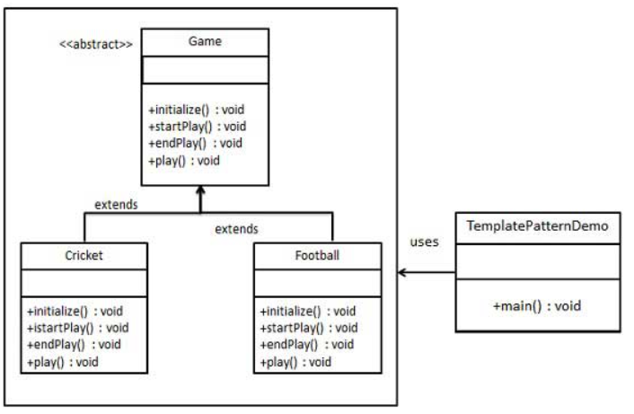

#### 3）观察者模式-Observer Pattern

**观察者模式（Observer Pattern）**，又称发布-订阅（Publish-Subscribe：Pub/Sub）。它是一种或通知机制，让发送通知的一方（被观察方）和接收通知的一方（观察方）能彼此分离，互不影响。

> 定义对象间的一种一对多的依赖关系，当一个对象的状态发生改变时，所有依赖于它的对象都得到通知并被自动更新。

在对象间存在一对多的关系时，则使用观察者模式。如，当一个对象被修改时，会自动通知它的依赖对象。

**[应用实例]：**

> 1、拍卖的时候，拍卖师观察最高标价，然后通知给其他竞价者竞价
>
> 2、电商网站，商品的上架、价格变动传递给 消费者 和 管理员

**[实例实现]：**

> 观察者模式使用三个类 Subject、Observer 和 Client。Subject 对象带有绑定观察者到 Client 对象和从 Client 对象解绑观察者的方法。我们创建 *Subject* 类、*Observer* 抽象类和扩展了抽象类 *Observer* 的实体类。*ObserverPatternDemo*，我们的演示类使用 *Subject* 和实体类对象来演示观察者模式。

**[实例类图]：**

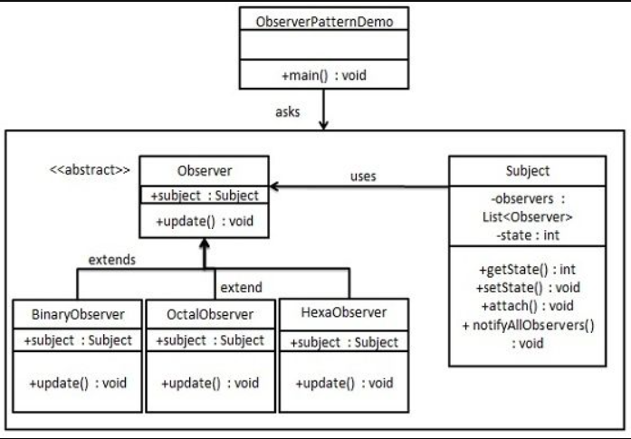

#### 4）迭代器模式-Iterator Pattern

**迭代器模式（Iterator Pattern）**，

> 提供一种方法顺序访问一个聚合对象中的各个元素，而又不需要暴露该对象的内部表示。

迭代器模式

#### 5）责任链模式

#### 6）命令模式

#### 7）备忘录模式

#### 8）状态模式

#### 9）访问者模式

#### 10）中介者模式

#### 11）解释器模式

## 4、参考文章

https://zhuanlan.zhihu.com/p/128145128

https://www.liaoxuefeng.com/wiki/1252599548343744/1281319134822433

