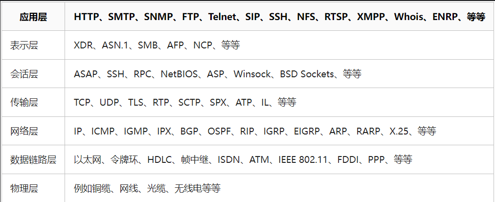

# 计算机网络各层常用协议及其默认端口

## 1、OSI七层模型

抽象程度由低到高，分别如下：

物理层——》》数据链路层——》》传输层——》》网络层——》》会话层——》》表示层——》》应用层

## 2、各层典型的物理设备

|OSI层级|物理设备|作用|
|:-:|:-:|:-:|
|物理层（Physical Layer）|网线、光纤、|传输介质|
|物理层（Physical Layer）|调制解调器（modem）|（传输器）数字信号与模拟信号相互转换|
|物理层（Physical Layer）|RJ45、SC、LC|将传输介质连接到计算机或者其他网络设备上|
|数据链路层（Data Link Layer）|网卡（Network Adapter）|将计算机内部的数据转换为帧格式，并将帧发送到物理层上传输|
|数据链路层（Data Link Layer）|网桥（Bridge）|用于在不同的物理子网之间实现数据的转发和连接|
|数据链路层（Data Link Layer）|交换机（Switch）|用于在局域网中实现数据的交换和转发，支持更高效、更可靠的数据传输|
|物理层（Physical Layer）|集线器（Hub）、重复器（Repeater）|负责将数字信号转换为物理信号，并通过物理媒介进行传输|
|物理层（Physical Layer）|中继器（Media Converter）|用于物理媒介之间的转换和传输|
|数据链路层（Data Link Layer）|网络适配器（Network Adapter）|负责将网络层（Network Layer）的数据包封装成帧，并发送到物理层进行传输|
|数据链路层（Data Link Layer）、网络层（Network Layer）|交换机（Switch）||
|网络层（Network Layer）|路由器（Router）|负责进行路由和转发决策，将数据包从源主机传输到目标主机|
|传输层（Transport Layer）|流量控制器（Flow Controller|负责对端到端的数据传输进行管理和控制，确保可靠性、流量控制|
|网络层、传输层|网络处理器（Network Processor）|用来处理网络流量的微处理器或芯片|
|OSI所有层|加速卡（Accelerator Card）|用来加速数据处理和传输的扩展卡，可以用于加速各个层级的处理和传输，例如加速 SSL/TLS 协议的处理和加密|
|应用层、传输层、网络层|安全网关（Security Gateway）|实现安全策略和防护的网络安全设备，如应用层、传输层和网络层的防火墙、入侵检测和预防|
|传输层、应用层|负载均衡器（Load Balancer）|平衡网络流量和资源负载的网络设备|

<table>     <tr>         <th>班级</th><th>课程</th><th>平均分</th>     </tr>     <tr>         <td rowspan="3">1班</td><td>语文</td><td>95</td>     </tr>     <tr>         <td>数学</td><td>96</td>     </tr>     <tr>         <td>英语</td><td>92</td>     </tr> </table>

## 3、各层常用协议及其默认端口

|OSI层级|协议名称|功能|默认端口|
|:-:|:-:|:-:|:-:|
|物理层|Ethernet|||
||Fast Ethernet|||
||Gigabit Ethernet|||
||RS-232（串口通信协议）|||
||V.35|||
||SONET（同步光纤网络）|||
|数据链路层|PPP（Point-to-Point Protocol）|||
||HDLC（High-level Data Link Control）|||
||MAC（Media Access Control）|||
||LACP（Link Aggregation Control Protocol）|||
||LLDP（Link Layer Discovery Protocol）|||
|网络层|IP（Internet Protocol）|||
||ICMP（Internet Control Message Protocol）|||
||ARP（Address Resolution Protocol）|||
||OSPF（Open Shortest Path First）|||
||BGP（Border Gateway Protocol）|||
||NAT|||
|传输层|TCP（Transmission Control Protocol）|||
||UDP（User Datagram Protocol）|||
||SCTP（Stream Control Transmission Protocol）|||
||DCCP（Datagram Congestion Control Protocol）|||
||QUIC|||
|会话层|RPC（Remote Procedure Call）|||
||NetBIOS（Network Basic Input/Output System）|||
|表示层|JPEG（Joint Photographic Experts Group）|||
||MPEG（Moving Picture Experts Group）|||
|应用层|HTTP（HyperText Transfer Protocol）|||
||FTP（File Transfer Protocol）|||
||SMTP（Simple Mail Transfer Protocol）|||
||DNS（Domain Name System）|||
||SNMP（Simple Network Management Protocol）|||
||POP|||
||POP3|||
||HTTPS|||
||HTTP/2|||
||WebSocket|||
||SSL/TLS|||
||SSH|||
||RTP|||
|||||
|||||
|||||
|||||
|||||
|||||

